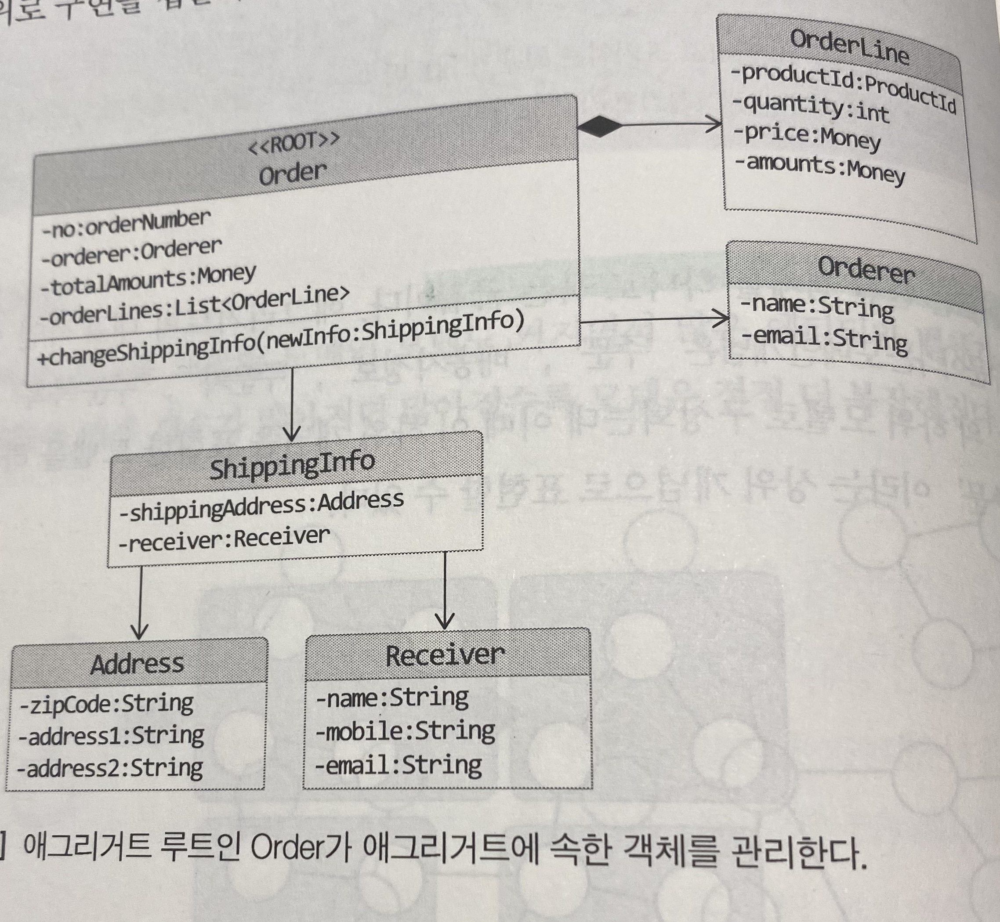

# DDD Start!
> 내맘대로 정리한 DDD Start!

## Chapter 01 - 도메인 모델 시작

* 도메인
  * 소프트웨어로 해결하고자 하는 문제의 영역
  * ex) 온라인 서점 = 구현해야 할 소프트웨어의 대상
* 도메인은 다시 여러개의 하위 도메인으로 구성될 수 있다
    
* 도메인 모델
  * 특정 도메인을 개념적으로 표현한 것(개념모델 O, 구현모델 X)
  * 도메인 모델을 사용하여, 여러 관계자들이 동일한 모습으로 도메인을 이해할 수 있다.
  * 도메인을 이해하는 데 도움이 된다면 어떤 표현 방식도 상관 없다.
    * ex) 상태 다이어그램, 클래스 다이어그램 ...
* 도메인 모델 패턴
  * 도메인 계층을 객체지향 기법으로 구현하는 패턴
    * 여기서, 도메인 모델은 도메인 계층 구현 시 사용하는 객체모델을 의미
  * 다른코드에 영향을 덜 주며 변경내역을 모델에 반영할 수 있다.
  * 도메인 모델 도출
    * 핵심 구성요소, 규칙, 기능을 찾는다.
    * 이 과정은 요구사항에서 출발
* 엔티티와 밸류
  * 엔티티
    * 식별자를 갖는다.
    * 자신의 라이프사이클이 존재
  * 밸류
    * 도메인 객체의 속성을 표현
    * 의미를 명확하게 하기 위해 사용하는 경우도 존재.
      * ex) Money 클래스

## Chapter 02 - 아키텍처 개요

* 표현, 응용, 도메인, 인프라스트럭처
  * 표현(UI) 영역
    * 사용자의 요청을 받아서 응용 영역에 전달 후 처리 결과를 다시 돌려주는 역할
  * 응용 영역
    * 로직을 수행하기 보단 도메인에 로직 수행을 위임하는 역할
    * 트랜잭션 관리의 역할
  * 도메인 영역
    * 도메인 모델을 구현
    * 도메인의 핵심 로직 구현
  * 인프라스트럭처 영역
    * 표현, 응용, 도메인 영역을 지원
    * 구현 기술에 대한 것을 다룬다.
      * ex) ORM, SMTP, MQ 등..
    * 논리적인 개념 보다는 실제 구현
* DIP
  * 인프라스트럭처 계층에 의존하면 테스트의 어려움, 기능 확장의 어려움
  * DIP는 저수준 모듈이 고수준 모듈에 의존하도록 한다. 그 비밀은 추상화 한 인터페이스에 있다.
    * 
  * 저수준 모듈만 바꿔 끼우면 된다. = 확장성
  * Mock 객체를 끼워서 저수준 모듈이 구현되지 않았음에도 테스트를 진행할 수 있다.
  * DIP가 적용된 최종 구조는 다음과 같다.
    * 
* 애그리거트
  * 관련 객체(엔티티, 벨류)를 하나로 묶은 군집
    * ex) 주문 도메인 = {주문, 배송, 주문자, 주문목록, 결제금액 ....}
  * 루트 엔티티를 갖는다.
    * 이를 통해, 간접적으로 다른 엔티티나 벨류 객체에 접근
      * 