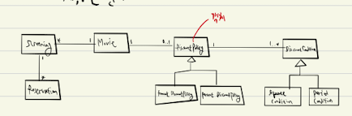
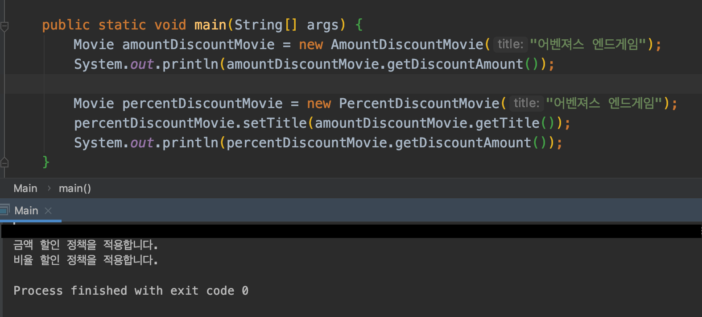
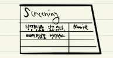
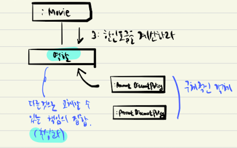

# Object
내맘대로 정리한 Object

## Chapter 01 - 객체, 설계
* 모든 소프트웨어 모듈의 3가지 원칙 (by 로버트 마틴)
  1) 제대로 동작하는 것 (이건 왠만하면 만족할 것)
  2) 변경에 용이할 것
  3) 코드를 읽는 사람이 쉽게 이해(의사소통)할 것(= 예상에서 크게 벗어나지 않을 것)

* 변경에 취약한 코드
  * 의존성이 많다. 최소한의 의존성만을 가지자.
  * 결합도가 높다. 응집도가 낮다.

    ```java
    public class Theater {
        private TicketSeller ticketSeller;

        public Theater(TicketSeller ticketSeller) {
            this.ticketSeller = ticketSeller;
        }

        public void enter(Audience audience) {
            if (audience.getBag().hasInvitation()) {
                Ticket ticket = ticketSeller.getTicketOffice().getTicket();
                audience.getBag().setTicket(ticket);
            } else {
                Ticket ticket = ticketSeller.getTicketOffice().getTicket();
                audience.getBag().minusAmount(ticket.getFee());
                ticketSeller.getTicketOffice().plusAmount(ticket.getFee());
                audience.getBag().setTicket(ticket);
            }
        }
    }
    ```

* 더 나은 설계?
  * 객체를 자율적인 존재로 만들자
    ```java
    ticketSeller.getTicketOffice().getTicket();  //bad
    ticketSeller.sellTo(audience);  //better
    ```

* 캡슐화
  * 객체 내부의 세부적인 사항을 감추는 것
  * 내부로의 접근을 막고 결합도를 낮춘다.

* 인터페이스와 구현의 분리
  * 결합도를 낮추고, 변경하기 쉬운 코드 작성을 위한 기본 설계 원칙

* Data와 Process를 동일한 모듈 내부로 하나로 모으는 것은 객체지향의 기본

* 어떤 기능을 설계하는 방법은 한가지 이상일 수 있다.
  * 꼭 객체지향적인 구현이 정답은 아닐 수 있다.
  * 적절한 의논을 통해 문제를 해결하자.
    ```java
    public class TicketOffice{
        // 객체 내부에서 구현을 하여 응집도를 높였으나, 
        // audience에 대한 의존성(어찌보면 불필요한?)이 생겼다. 
        // 의논이 필요한 시점!
        public void sellTicketTo(Audience audience) {
            plusAmount(audience.buy(getTicket()));
        }
    }
    ```
* 협력하는 객체들간의 의존성을 적절히 조절하자
  * 다른 객체로의 "메시지 전달"을 위해서는 의존성을 가질 수 밖에 없다.
  * 의존성이 무조건적으로 없어져야 하는 것은 아니다.

## Chapter 02 - 객체지향 프로그래밍

* 객체지향 프로그래밍 2가지 원칙
  * 클래스에 대해 고민하기 전 "객체"에 대해 고민하자
  * 객체를 협력하는 공동체의 일원으로 보아야한다.
* 도메인
  * 문제를 해결하기 위해 사용자가 소프트웨어를 사용하는 분야
    
    
  * 클래스 사이의 관계와 도메인 사이의 맺어진 관계와 유사하게 만들어 이해를 쉽게하자
* 객체 내부에 대한 접근 통제의 이유
  * 자율성 보장
  * 객체 스스로가 메서드를 통해 최선의 방법을 결정할 것이라는 믿음
* 컴파일 시간 의존성 VS 실행 시간 의존성
  * Early Binding VS Lazy Binding
  * 컴파일 시간 의존성
    * 코드 이해 쉬워짐
    * 디버깅이 쉬워짐
    * 재사용성과 확장성이 떨어짐
  * 실행 시간 의존성
    * 코드 이해가 어려워짐
    * 디버깅이 복잡해짐
    * 재사용성이 높아지고, 확장성이 늘어남
* 다형성
  * 동일한 메시지를 수신하였을 때, 객체의 타입에 따라 다르게 응답할 수 있는 능력
* 상속이 가치있는 이유
  * 부모클래스의 모든 인터페이스를 자식클래스가 물려받기 때문
  * 부모의 모든 메시지를 수신할 수 있기에 동일한 타입으로 간주할 수 있는 것
* 추상화의 힘
  * 요구사항의 정책을 높은 수준에서 서술
  * 세부사항에 억눌리지 않고 도메인의 중요개념을 설명할 수 있다.
  * ex) 영화예매요금은 최대 하나의 할인정책(금액할인, 비율할인)과 다수의 할인조건(기간할인, 순차할인)을 이용해 계산할 수 있다.
* 코드 재사용을 위해 상속보다 합성
  * 상속은 캡슐화를 위반한다.
    * 자식이 부모의 행위를 알아야한다.
    * 따라서, 부모의 행위가 바뀌면 자식이 영향을 받을 수 있고
    * 부모와의 결합도가 높기때문에 유연하지 못할 수 있다.(변경의 어려움)
  * 상속은 설계가 유연하지 못하다.
    * 인스턴스를 바꾸고 싶다면, 실행중에 새로운 인스턴스를 생성하여 복사를 해줘야한다.
    
    
  * 합성은 캡슐화를 보장한다.
    * 인스턴스 변수의 메시지를 호출하면 된다.
      ```java
      public class Movie{
        private DiscountPolicy discountPolicy;

        public int getDiscountAmount(){
          // 메시지를 호출.
          // 객체의 구현을 숨겨 캡슐화를 보장한다.
          return discountPolicy.calculateDiscountAmount();
        }
      }
      ```
  * 합성은 유연한 설계를 제공한다.
    * 인스턴스를 바꾸고 싶다면, 메서드를 추가해 인스턴스 변수만 바꿔주면 된다.
      ```java
      movie.changeDiscountPolicy(new PercentageDiscountPolicy());
      ```
  * 그렇다면, 상속은 쓰지말아야하나?
    * 상속의 경우 다형성을 위해 활용된다.
    * 적절히 섞어서 잘 쓰자.

## Chapter 03 - 역할, 책임, 협력

* 객체의 행동을 결정하는 것은 협력이다.
  * 협력은 곧 객체의 존재 이유
* 책임의 종류는 2가지가 있다.
  * 하는 것
  * 아는 것
    
    
* "시스템이 사용자에게 제공하는 기능"을 협력의 출발점으로 간주한다.
  * ex) 영화예매시스템
* 메시지가 객체(책임)를 선택한다.
  * 메시지가 객체를 선택해야 하는 2가지 이유
    1) 추상 인터페이스
        * 어떻게(How)가 아닌 무엇(What)에 초점을 맞출 수 있다.
    2) 최소 인터페이스
        * 필요한 메시지 식별시에만 인터페이스를 추가한다.
* 행동이 상태를 결정한다.
  * 상태를 중심으로 개발(데이터 주도 개발)을 하게되면 퍼블릭 인터페이스를 통해 내부를 노출 시키게 된다.
  * 캡슐화가 저해된다.
  * 즉, 상태는 행위를 보조하는 수단일 뿐이어야 한다.
* 역할
  * 책임의 집합
  * 역할을 통해 유연하고 재사용 가능한 협력을 얻는다.
  * 객체를 바꿔 끼울 수 있는 일종의 슬롯
  
  