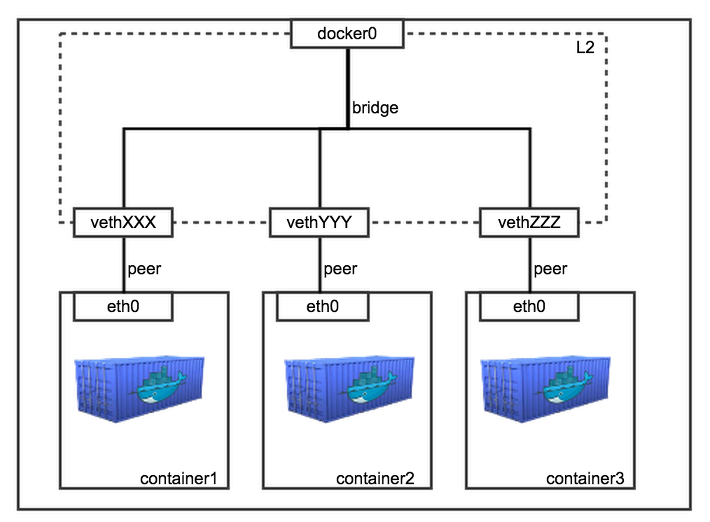

# Docker란

### Docker란?
컨테이너 기반의 오픈소스 가상화 플랫폼. 다양한 프로그램, 실행환경을 컨테이너로 추상화 후 배포 및 관리를 단순화해준다.

### 기존의 가상화와 어떻게 다른가?
기존에는 주로 OS를 가상화. 호스트 OS 위에 게스트 OS를 가상화하는 방식으로 사용법이 간단하지만 무겁고 느리다. <br/><br/>
반면에, 도커는 프로세스를 격리하는 방식으로 가볍고 빠르다. 자원도 프로세스가 필요로 하는 만큼만 할당하기 때문에 성능 손실이 거의 없다.

### 도커의 네트워크 방식

크게 4가지가 있지만, 2가지만 살펴본다.

1. bridge 모드
* 도커의 Default 네트워크 방식
* 도커 데몬 실행 시 docker0라는 bridge가 생성된다.
* 컨테이너마다 고유한 network namespace가 하나씩 생성되며, docker0 bridge에 하나씩 binding 되는 구조이다.



2. host 모드
* 컨테이너가 독립적인 네트워크 영역을 갖지 않고 호스트와 네트워크를 함께 사용하게 된다.
* 성능상의 이점이 있다.

```
--net=host
```

### 이미지

컨테이너 실행에 필요한 파일과 설정 값 등을 포함하고 있다. 실행에 필요한 모든 것을 담고 있다.<br/>
ex) Gitlab 이미지는 Centos를 기반으로 ruby, go, database, redis, gitlab source, nginx 등등 포함하고 있다.

### 레이어 저장방식

레이어라는 개념을 사용하여, 파일이 추가되거나 수정되면 기존의 레이어에 새로운 레이어만 추가될 뿐이다. 이에 이미지 용량을 효율적으로 관리하고 새로운 이미지를 내려받는데 캐싱이 되어있어 시간적으로 유리하다.

### 태그기능

이미지는 url + 태그의 형태로 조합이 되며 이 태그기능을 이용해 롤백을 쉽게 할 수도 있다.