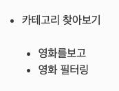

# Locust

Locust 사용하기 쉽고 분산 처리 테스팅이 가능한 부하 테스트 툴이다. 파이썬으로 되어있으며 설치와 사용이 편리하다.
단일 컴퓨터에서 수천명의 동시 사용자를 지원한다.

<a href = "https://locust.io/">https://locust.io/</a>

## 설치
생략

## locustfile 작성

### task_set
task_set은 클라이언트가 어떻게 부하를 줄 지에 대한 시나리오(클래스)이다. task들의 집합으로 이뤄져 있다.

```python
class MyTaskSet(TaskSet):

    wait_time = between(5, 15)

    @task(3)
    def task1(self):
        pass

    @task(6)
    def task2(self):
        pass
```

* Task
    * 개별 task는 @task 어노테이션(데코레이터 패턴)으로 정의할 수 있으며, TaskSet안에 task들은 random하게 실행되게 된다.
    * 괄호안의 숫자는 가중치가 된다. 즉, 3:6의 비율로 실행하게 된다.

* wait_time
    * Task 실행 후 다른 Task 수행 시 까지 delay 타임을 줄 수 있다
    * between메서드 이외에 constant함수를 써서 대기 시간을 고정값으로 줄 수도 있다.
    
```python
wait_time = constant(5)
```

* 중첩 TaskSet
    * TaskSet들은 서로 중첩될 수 있다.
    


예시
```python
class ForumPage(TaskSet):
    @task(20)
    def read_thread(self):
        pass

    @task(1)
    def new_thread(self):
        pass

    @task(5)
    def stop(self):
        self.interrupt()

class UserBehaviour(TaskSet):
    tasks = {ForumPage:10} # 10은 가중치, 10배가 많이 호출된다.

    @task
    def index(self):
        pass
```

* TaskSequence
    * Task들을 순차적으로 실행시킨다.
    
예시
```python
class MyTaskSequence(TaskSequence):
    @seq_task(1)
    def first_task(self):
        pass

    @seq_task(2)
    def second_task(self):
        pass

    @seq_task(3)
    @task(10)
    def third_task(self):
        pass
```
주의할 점은, 마지막 3번 task의 괄호안에 숫자는 가중치가 아니라 10번 수행된다는 뜻이다.

### Hook
TaskSet 실행 전 후에 Hook을 정의 할 수 있다. Hook의 종류는 다음과 같다.
1. setup, teardown
    * setup과 teardown은 locust 혹은 taskset(전체 클라이언트)에 대하여 한번만 실행되며 각각 시작되기 전과 종료 된 후를 의미한다.  
2. on_start, on_stop
    * on_start, on_stop의 경우 TaskSet에 대해 클라이언트가 생성될 때마다 한번씩 실행된다.
    
예시
```python
from locust import Locust,TaskSet,task,between

class UserBehavior(TaskSet):

	def setup(self):
		print("nested SETUP");

	def teardown(self):
		print("nested TEAR DOWN");

	def on_start(self):
		print("nested on start");

	def on_stop(self):
		print("nested on stop");

	@task(1)
	def task1(self):
		print("task1")

	@task(1)
	def task2(self):
		print("task2")

class User(Locust):

	task_set = UserBehavior
	wait_time = between(1,2)

```

실행순서

1. Locust setup
2. TaskSet setup
3. TaskSet on_start
4. TaskSet tasks…
5. TaskSet on_stop
6. TaskSet teardown
7. Locust teardown

### 성공 여부 수동제어

응답코드가 실패한 결과에 대해서도 성공으로 간주할 수 있도록 하는 방법이다.

404에러에 대한 예시
```python
with self.client.get("/does_not_exist/", catch_response=True) as response:
    if response.status_code == 404:
        response.success()
```

반대로 성공한 경우에도 실패로 바꿀 수 있다.

```python
with self.client.get("/", catch_response=True) as response:
    if response.content != b"Success":
        response.failure("Got wrong response")
```

### Oauth 인증을 통한 실제 사용 사례

https://dejavuqa.tistory.com/131